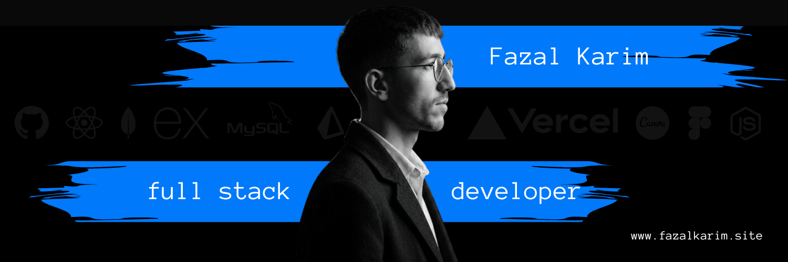

<!-- HERO SECTION -->

  

---

# 👨‍💻 About Me

Hi, I'm **Fazal Karim**, a passionate **Full Stack MERN Developer** focused on building scalable, secure, and production-ready web applications.

I enjoy transforming ideas into modern digital products through clean architecture, responsive user experiences, and efficient backend systems.

### What I Focus On

- Full Stack MERN Development
- Authentication & Authorization Systems
- RESTful APIs & Backend Architecture
- Modern UI/UX Development
- Dashboard & Admin Panel Development
- Real-Time Applications
- AI-Powered Web Solutions

---

# 🚀 Tech Stack

## Frontend

  

## Backend

  

## Database & ORM

  

## Tools & Platforms

  

## Additional Skills

  

---

# 🏆 Featured Projects

## 🎟️ Bookifyr — Event Booking Platform

A full-stack MERN event booking system featuring:

- JWT Authentication
- OTP Email Verification
- Admin Dashboard
- Booking Approval System
- Real-Time Seat Tracking
- Event Analytics
- Email Notifications

**Tech:** React, Node.js, Express, MongoDB

---

## 🍽️ Restaurant POS System

Modern Point of Sale application designed for restaurants.

Features:

- Order Management
- Billing System
- Role-Based Authentication
- Dashboard Analytics
- Inventory Management
- Sales Tracking

**Tech:** MERN Stack

---

## 🔐 MERN Authentication System

Authentication system with:

- Email Verification
- OTP Authentication
- Forgot Password
- Reset Password
- JWT Security
- Protected Routes

**Tech:** React, Node.js, MongoDB

---

## 📊 GitHub Analytics

  

<!-- 

  
  

  
  

  -->

  

---

# 📈 Contribution Activity

---

# 🌐 Connect With Me

---

# 💡 Developer Philosophy

> Build solutions that are scalable, maintainable, and user-focused.
>
> Clean code, secure systems, and great user experience always come first.

---
