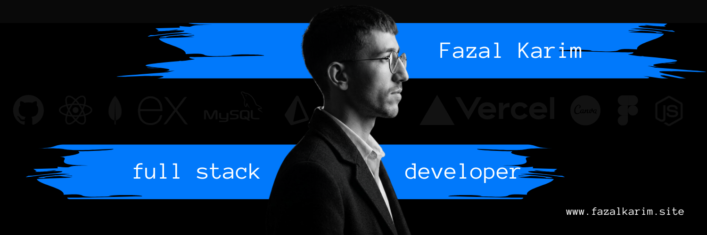

<!-- HERO SECTION -->

  

---
# 👨‍💻 About Me

**Full Stack Developer & SaaS Engineer** specializing in building scalable, secure, and production-ready digital products.

I work across the full application stack using **Next.js, React, Node.js, NestJS, Express.js, TypeScript, PostgreSQL, MongoDB, and Prisma** to develop high-performance web applications, SaaS platforms, and business systems.

My experience includes building **multi-tenant SaaS applications, POS/ERP systems, admin dashboards, role-based platforms, APIs, authentication systems, real-time features, and complex business workflows**.

I focus on creating solutions that are not only functional, but also **well-architected, maintainable, secure, responsive, and built to scale**.

### 🚀 Core Expertise

* Next.js & React Application Development
* Full Stack Web Development
* SaaS Product Development
* Multi-Tenant Architecture
* POS, ERP & Business Management Systems
* Backend Architecture & REST APIs
* Authentication & Role-Based Access Control
* PostgreSQL & MongoDB Database Design
* Prisma ORM & Data Modeling
* Admin Dashboards & Internal Tools
* Real-Time Application Features
* AI-Powered Web Solutions
* Subscription & Payment Workflows
* Responsive & Modern UI Development
* Performance Optimization & Production Deployment

### 💼 Engineering Approach

I approach development with a product-first mindset - understanding the business requirements, designing the right architecture, and building systems that remain reliable as they grow.

From frontend experience and backend logic to database design, security, integrations, and deployment, I focus on delivering **complete end-to-end solutions that solve real business problems and are ready for production use.**

## 🛠️ Tech Stack

---

<table width="100%">
<tr>
<td align="center" width="25%">
<h3>Frontend</h3>
 

</td>
<td align="center" width="25%">
<h3>Backend</h3>

</td>
<td align="center" width="25%">
<h3>Database & ORM</h3>

</td>
<td align="center" width="25%">
<h3>Tools</h3>
 

</td>
</tr>
</table>

---

# 🏆 Featured Projects

## 🧾 SmartPOS - Multi-Tenant POS & ERP System

A full-stack Point of Sale and ERP platform built for retail businesses, featuring:

- Multi-Branch & Multi-Tenant Architecture
- Role-Based Access Control
- POS Sales & Payment Management
- Inventory & Stock Management
- Serialized Products with IMEI/Serial Tracking
- Customer, Vendor & Purchase Management
- Receivables, Payables & Expense Tracking
- Returns & Partial Payment Handling
- Sales Reports & Business Analytics
- Branch-Wise Dashboard & Revenue Insights

**Tech:** Next.js, NestJS, Prisma ORM, PostgreSQL

---

## 🍽️ Smart-Ai-Recipe-Platform

A full-stack AI-powered recipe platform that generates personalized recipes from a simple dish name, providing detailed ingredients, preparation steps, cooking instructions, serving information, and an easy-to-follow recipe experience with secure user authentication and recipe management.

Features:

- AI-Powered Recipe Generation
- Complete Ingredient Lists
- Step-by-Step Cooking Instructions
- Personalized Recipe Suggestions
- User Authentication with Clerk
- Recipe Management with Strapi CMS
- PostgreSQL Database
- Downloadable Recipe PDFs
- Responsive Modern Interface
- Dark & Light Theme Support
- Secure API Protection with Arcjet

**Tech:** Next.js 16, React 19, Strapi 5, PostgreSQL, Clerk, Tailwind CSS

---

## 🧘 Yoga Wellness Tracker

A full-stack wellness platform designed to improve physical fitness, mindfulness, 
and mental well-being through AI-powered yoga tracking and interactive activities.

**Key Features:**
- Real-Time Yoga Pose Detection
- AI-Based Pose Accuracy Feedback
- Multiple Yoga Sessions and Exercises
- Mindfulness Meditation Activities
- Interactive Wellness Games
- User Progress and Activity Tracking
- Secure JWT Authentication
- Email Verification
- Forgot and Reset Password
- Protected User Routes
- Personalized Wellness Dashboard
- Responsive Design for Mobile and Desktop
  
**Tech-stack:**

- Frontend: Next.js
- Database: MongoDB and SQLite
- ORM: Prisma
- Authentication: JWT
- Computer Vision: Real-Time Yoga Pose Detection
- Security: Email Verification and Secure Password Reset

---

## 📊 GitHub Analytics

  

<!-- 

  
  

  
  

  -->

  

---

# 📈 Contribution Activity

---

# 🌐 Connect With Me

---

# 💡 Developer Philosophy

> Build solutions that are scalable, maintainable, and user-focused.
>
> Clean code, secure systems, and great user experience always come first.

---
